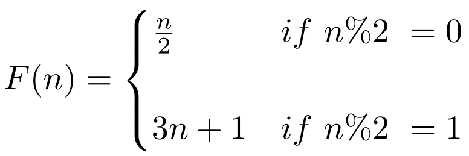

<h1> <center>Collatz-Conjecture (3n+1)</center> </h1>
This Collatz-Conjecture (3n+1) algorithm prints each calculated sequence in a given interval of integers.


<br>
The Collatz-Conjecture is a conjecture in mathematics that concerns a sequence defined as follows: 

1. Start with any positive integer n.
2. Then each term is obtained from the previous term. If the previous term is even, the next term is half of the previous term. If the previous term is odd, the next term is x3 the previous term, plus 1.


The conjecture is that no matter what value of n, the sequence will always reach 1 at some point.


## What does this program do?

#### For each number tested in the interval
- Lists all the visited numbers in order (e.g 5, 16, 8, 4, 2, 1),

#### Output post calculation
- Largest integer reached

- What iteration had the largest integer

- The longest sequence

- Total count of nodes (numbers) visited

- Number of sequences calculated


## Different languages

### **Python**
Preferably executed with python3, ``python 3NPlus1.py`` in terminal.

In `3NPlus1.py` the max number to calculate is defined on line 29.

Default max value: 50
```py
26 ...
27 
28 def main():
29      upper_limit = 50
30
31 ...
```

### **Node.js**

Preferably executed in terminal using ``node 3NPlus1.js`` .

In `3NPlus1.js` the interval of numbers to calculate is defined on line 5.

Default max value: 50
```js
3 ...
4 */
5 const stats = await startCount(1,50);
6
7 ...
```

### **C/C++**

Preferably executed with gcc, ``gcc 3NPlus1.c``. Then run the executable in the terminal.

In `3NPlus1.c` the max number to calculate is defined on line 33.

Default max value: 50
```c++
30 ...
31
32 int main() {
33      int upperLimit = 50;   
34      ...
```